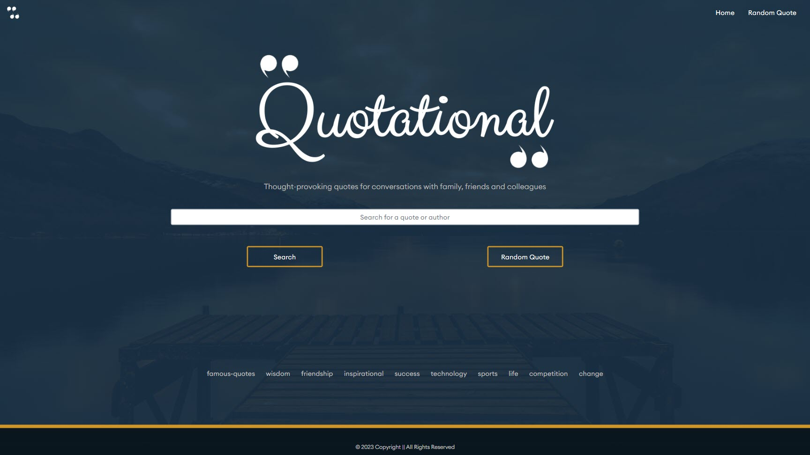
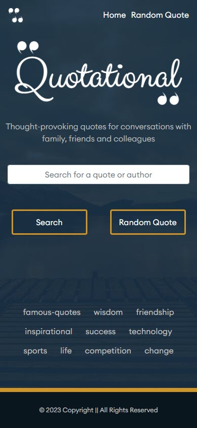

# Quotational

## Table of Contents
  - [Description](#description)
  - [Installation](#installation)
  - [Usage](#usage)
  - [Credits](#credits)
  - [Useful Information](#useful-information)
  - [License](#license)
  
## Description
For this project, I was asked to build a simple quote application, that incorportated a CSS framework of my choice and must consume at least two APIs. 

I wanted the UI to have a clean, calming and classy look to it. I wanted it to be easy to navigate and for the user to have a simple and enjoyable experience. 

In order to achieve this I chose to work with bootstrap as this has a clean look and is simple to use, it also allowed me to build the basis of my site quite quickly and made styling very simple. 

The application uses 3 APIs in total:
- [Quotable](https://quotable.io/) created by [Luke Peavey](https://github.com/lukePeavey) for all the quotes 
- [Unsplash](https://unsplash.com/) for the background images
- [MediaWiki](https://www.mediawiki.org/wiki/API:REST_API) for the author excerpt 

Throughout the project I have made use of local storage to store information and call at a later stage, I also made sure that the site was responsive by incorporating some media queries.

## Installation
Clone the repository onto your machine and open with VS Code or similar program
  
## Usage 
See the demo video below:

https://user-images.githubusercontent.com/90259065/227189041-78d4aa8e-df9d-4280-ae2c-8ea948f8a284.mp4

Here is a screenshot of the homepage

 

And here is a mobile view to show the responsiveness

## Credits
- Button CSS - Made by ernestnash - [see here](https://uiverse.io/ernestnash/cold-turtle-83)
- [Quotable API](https://quotable.io/) created by [Luke Peavey](https://github.com/lukePeavey) for all the quotes 
- [Unsplash API](https://unsplash.com/) for the background images
- [MediaWiki REST API](https://www.mediawiki.org/wiki/API:REST_API) for the author excerpt

  
## Useful Information
The page is deployed using GitHub pages - [here](https://rbrd87.github.io/quotational/)

For any questions or further information please get in touch via GitHub or email

- GitHub - [https://github.com/rbrd87](https://github.com/rbrd87)

- Email - [rochellembradley@gmail.com](mailto:rochellembradley@gmail.com)

## License 
This project is licensed under the terms of [MIT License ](../LICENSE)
